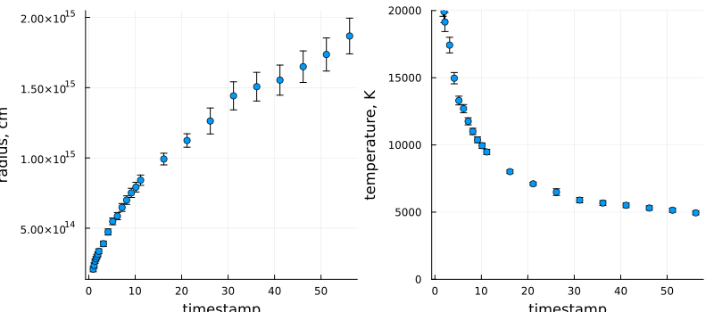

# PhotometryFit.jl

A simple package to fit photometry data to different spectral distributions.

## Installation

Paste this into the Julia REPL:

```julia
import Pkg
Pkg.add(url="https://github.com/aryavorskiy/PhotometryFit.jl")
```

## Example usage

As an example let us fit the SN2013fs photometry data using the black body spectrum.

```julia
using PhotometryFit
using Plots                 # Visualization
using DelimitedFiles        # Reading data files
import UnitfulAstro: ly     # Astronomical measurement units

ser = read_photometry_data(                         # Read photometry data
    FilterFolder("data/Filters/", :photon),         # Filters info is located in this folder
    "data/data_13dqy_formatted_for_package.txt",    # And the photometry data is here
    unit=Flux(dist=160e6ly))                # Photometry data is provided in flux values, star is 160Mly far

dates = readdlm("data/13dqy_int_dates.txt") |> vec  # Dates where we will evaluate the spectrum

fit_ser = fit(ser, BlackBodyModel(), dates)         # Fit using the BB model
scatter(fit_ser)                                    # And plot
```

This code yields the following picture:



Note that you may need to install `Plots` and `UnitfulAstro` packages. You can do this as follows:

```julia
import Pkg
Pkg.add("Plots")
Pkg.add("UnitfulAstro")
```